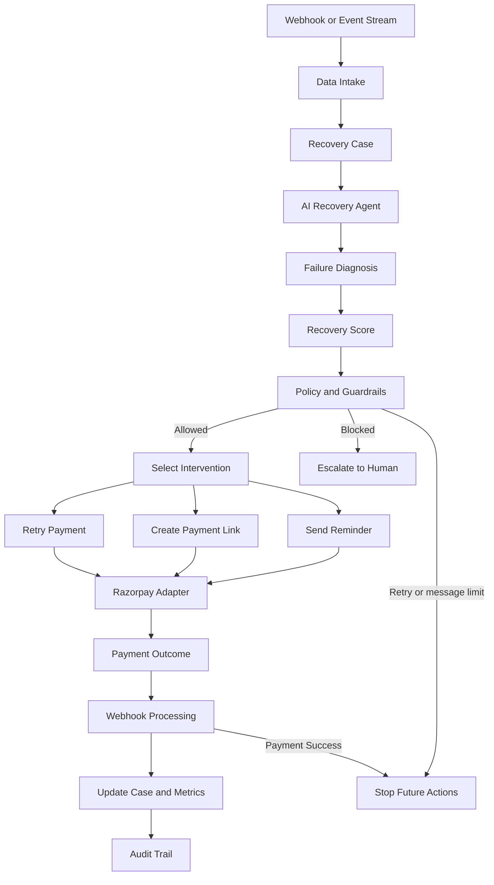

# AI Revenue Recovery Orchestrator

## Razorpay Buildathon Track 03

**Track:** AI Revenue Recovery  
**Team demo:** AI Revenue Recovery Orchestrator  
**Current demo mode:** Synthetic transactions, simulated recovery, Dockerized local deployment

> This document is a Confluence-style presentation draft. It is written for review first. Nothing in this document has been pushed as part of this edit.

---

## 1. Executive Summary

Revenue loss does not happen in one clean step. A bank times out, a customer abandons an OTP flow, a subscription mandate fails, or an invoice becomes overdue. The payment platform can detect the failure, but detection alone does not recover the money.

Our solution closes that loop:

```text
Detect -> Diagnose -> Score -> Apply guardrails -> Intervene -> Measure -> Stop -> Audit
```

The AI Revenue Recovery Orchestrator turns a failed payment into a bounded recovery case. It determines why the payment failed, estimates whether recovery is likely, selects the least-friction intervention, executes it through the payment adapter, measures recovered revenue, and stops when the customer pays or a safety limit is reached.

---

## 2. The Real Business Problem

For an Indian digital business, a failed payment is not always a lost customer. It may be a temporary bank outage, an OTP or authentication interruption, an expired card, insufficient funds, a revoked mandate, or an overdue invoice.

The operational problem is that a generic retry is not enough:

- A transient bank timeout may deserve a delayed retry.
- An expired card should not receive repeated retries; the customer needs a payment-method update.
- A high-value overdue invoice may require human review.
- A customer who has already been contacted too many times should not receive another automated message.
- A successful payment must stop all future recovery actions immediately.

The track therefore asks for more than a dashboard. It asks for an agent that can make a decision, take a bounded action, measure money recovered, escalate safely, and explain every step.

### Business impact

The result of poor recovery is:

- Revenue lost after a temporary payment failure
- Checkout conversion loss caused by payment friction
- Involuntary subscription churn
- Manual collections work for finance and support teams
- Customer frustration from blind retries or excessive outreach
- Weak auditability when nobody can explain why an action was taken

---

## 3. Razorpay-Relevant Failure Categories

The following categories frame the problem using the production realities supplied for this buildathon. Any external percentages or product claims should be verified against the latest official Razorpay material before final publication.

### A. Payment gateway and issuer failures

Typical signals:

- `issuer_unavailable`
- `bank_down`
- `bank_timeout`
- OTP delivery delay
- Network timeout
- Gateway or routing failure

Correct recovery behavior:

- Diagnose whether the failure is transient.
- Avoid an immediate retry storm.
- Schedule a retry after a cool-off period.
- Stop after the configured retry limit.

Razorpay context:

- Optimizer-style routing can select a higher-performing payment route.
- A recovery agent operates one layer above that: it decides what to do after a payment has already degraded or failed.

### B. Checkout and cart drop-offs

Typical signals:

- `checkout_dropped`
- `auth_failed`
- OTP interruption
- Payment-method confusion
- Customer hesitation after a failed attempt

Correct recovery behavior:

- Send a low-friction payment link or UPI intent option.
- Use the customer’s preferred channel.
- Avoid repeated messages.
- Stop outreach when the customer pays or declines.

Razorpay context:

- Failed-payment recovery and Magic Checkout-style experiences reduce friction by re-engaging a customer with a payment link.

### C. Subscription churn and overdue receivables

Typical signals:

- `insufficient_funds`
- `card_expired`
- `mandate_revoked`
- `invoice_overdue`
- `invoice_unpaid_30d`

Correct recovery behavior:

- Align soft-decline retries to a sensible pay-cycle window.
- Halt retries for hard declines or revoked mandates.
- Ask the customer to update the payment method.
- Escalate high-value B2B cases to a human or promise-to-pay workflow.

Razorpay context:

- Subscription and invoice events arrive asynchronously.
- Webhooks and reconciliation are essential because payment state can change after the original attempt.

---

## 4. Our Solution

Our orchestrator receives a failed payment or at-risk transaction and creates an explainable recovery decision.

### Inputs

- Customer payment history
- Transaction amount
- Failure reason
- Retry count
- Payment method
- Lifetime value
- Recency of activity
- Previous message count

### Decision outputs

- Recovery score
- Failure diagnosis
- Recommended action
- Guardrail status
- Execution result
- Current workflow status

### Available interventions

- Retry payment
- Generate a payment link
- Send a reminder
- Escalate to human support

### Measured outputs

- Revenue at risk
- Recoverable amount
- Recovered amount
- Recovery rate
- Daily recovered revenue
- Cumulative monthly recovery
- Audit event and stopping reason

---

## 5. End-to-End Pipeline



### Orchestration owner in the repository

The central orchestration is:

```text
backend/services/recovery_service.py
```

The main method is:

```text
RecoveryService.process(customer, transaction)
```

It coordinates:

1. `RecoveryAgent.analyze()`
2. `evaluate_action()` from the policy layer
3. The selected Razorpay adapter action
4. Escalation when an action is blocked
5. The final decision, execution result, and workflow status

---

## 6. How The Agent Makes A Decision

### Step 1: Diagnose

The agent maps the failure reason to a human-readable diagnosis.

Example:

```text
Failure: insufficient_funds
Diagnosis: Temporary insufficient funds with a strong recent payment history.
```

### Step 2: Score recoverability

The scoring layer considers customer and transaction context, including successful history, failed history, amount, and failure reason.

A reliable customer with one temporary failure can score highly. A high-value overdue case with repeated failures can score lower and require escalation.

### Step 3: Recommend an action

The decision layer chooses between:

- Retry
- Payment link
- Reminder
- Escalation

### Step 4: Apply policy

The action is not executed until the guardrail layer approves it.

---

## 7. Bounded Recovery And Stopping Rules

The track specifically requires compliant escalation and stopping rules. Our policy layer demonstrates:

- Maximum retry count
- Maximum customer messages
- High-value case escalation
- Recovery-window configuration
- Retry-gap configuration
- Human escalation when automation is unsafe
- Stop behavior after a successful payment event

### Production extension rules

For a production deployment, we would add:

- Maximum three WhatsApp nudges over seven days
- Maximum four retries over fourteen days
- No voice recovery between 10 PM and 8 AM IST
- Immediate halt on `mandate.cancelled` or `subscription.halted`
- Customer opt-out and consent state
- Rate limiting and channel-level compliance controls

These rules should be configured with the merchant’s legal, compliance, and communication policies rather than hard-coded blindly.

---

## 8. Audit Trail

Every recovery action should be explainable.

Example production-shaped event:

```json
{
  "recovery_id": "rec_98234712",
  "transaction_id": "pay_Kx87sD912x",
  "original_amount": 4999.0,
  "failure_reason": "INSUFFICIENT_FUNDS",
  "action_taken": "SCHEDULED_PAY_DAY_RETRY",
  "channel": "WHATSAPP",
  "stopping_rule_triggered": false,
  "recovered": true,
  "net_recovered_amount": 4999.0,
  "timestamp": "2026-09-04T22:25:41Z"
}
```

Our repository supports auditability through:

- `backend/storage/recovery_store.py`
- Audit-log persistence tables
- `/api/audit-trail`
- `/api/recovery-timeline`
- Agent diagnosis and policy reason fields

---

## 9. Current Demo Metrics

The demo intentionally uses synthetic values:

- Revenue at risk: `INR 25,00,000`
- Recoverable amount: `INR 16,80,000`
- Recovered amount: `INR 8,73,450`
- Recovery rate: `51.9%`
- Transactions analyzed: `10,000`
- Recoverable cases: `2,840`

The dashboard includes a 30-day graph:

- Blue bars: daily recovered revenue
- Red line: cumulative recovered revenue
- Simulation button: updates recovered amount, revenue at risk, and recovery rate

No real money moves during this demo.

---

## 10. Demo Walkthrough

1. Open the dashboard at `http://localhost:8000`.
2. Show revenue at risk, recoverable amount, recovered amount, and recovery rate.
3. Explain that the values are synthetic for safe demonstration.
4. Show the 30-day daily and cumulative recovery graph.
5. Open `/api/recovery-cases` and show failure reasons, scores, actions, and statuses.
6. Open `/api/agent/decision` and explain the diagnosis and recommended action.
7. Explain retry, message, and high-value guardrails.
8. Click `Simulate recovered payment`.
9. Show recovered revenue increasing and recovery rate changing.
10. Send a simulated `payment.captured` event.
11. Explain that success stops future recovery actions.
12. Show the audit trail and recovery timeline.

### Suggested narration

> “We are not treating every failed payment as the same. A temporary bank issue can receive a delayed retry, while an expired card needs a payment-method update and a high-value overdue invoice needs human review. The agent makes the decision, policy limits the action, and the audit trail explains the result.”

---

## 11. What Is Implemented Versus Simulated

### Implemented in the current repository

- FastAPI API and dashboard
- Synthetic transaction batch
- Failure diagnosis
- Recovery scoring
- Action recommendation
- Policy guardrails
- Retry, payment-link, reminder, and escalation adapters
- Webhook event interpretation
- Webhook signature verification when a secret is configured
- SQLite recovery and audit storage
- Monthly recovery graph
- Docker and Docker Compose deployment
- Automated tests

### Simulated for the demo

- Transaction batch
- Money recovered
- Recovery button
- Local payment-success webhook
- Razorpay actions when credentials are absent

### Requires external production setup

- Real Razorpay Test Mode API calls
- Live payment links
- Public HTTPS webhook endpoint
- Real webhook delivery
- Persistent background worker deployment
- Production monitoring, authentication, and secret management

---

## 12. Why This Solves The Track

| Track requirement | Our implementation |
|---|---|
| Detect revenue at risk | Synthetic batch, failure reasons, dashboard metrics |
| Diagnose the issue | Recovery agent and failure taxonomy |
| Choose an intervention | Score-driven retry, link, reminder, or escalation |
| Execute a bounded workflow | Recovery service plus policy guardrails |
| Show measured money recovered | Recovered amount, recovery rate, and monthly graph |
| Compliant escalation | High-value cases and blocked actions escalate |
| Stopping rules | Retry/message limits and payment-success stop behavior |
| Audit trail | SQLite audit records, timeline, reasoning, and result |

The core value is not just identifying a failed payment. It is closing the operational loop from failure to measured recovery while preserving control and explainability.

---

## 13. Honest Positioning

Use this wording during judging:

> “This is a working synthetic-data demonstration of the recovery decision engine and measurement loop. It does not claim that real money moved. The Razorpay adapter and webhook boundary are ready for Test Mode credentials and a public webhook endpoint, while the demo uses deterministic simulations so the judges can see the full flow safely.”

---

## 14. Final Judging Pitch

> “Our AI Revenue Recovery Orchestrator turns failed payments into bounded, explainable recovery cases. It diagnoses the failure, scores the probability of recovery, selects the least-friction intervention, applies retry and communication guardrails, measures recovered revenue across a batch, and stops when payment succeeds. The dashboard makes the business outcome visible, while the audit trail makes every decision defensible.”

---

## 15. Local Review Status

This document was created locally for review. It has not been pushed to GitHub yet. After approval, it can be added to the repository and committed separately.
