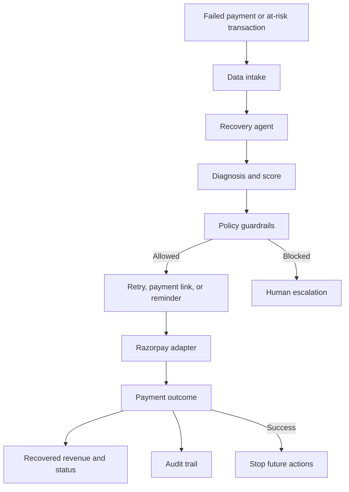

# AI Revenue Recovery Orchestrator

An AI-style revenue recovery pipeline for the Razorpay AI Revenue Recovery track.

> The demo uses synthetic transactions and simulated recovery values. It does not move real money.

## Track Fit

The track asks us to find revenue that is slipping away, choose the right intervention, execute a bounded workflow, and show measured money recovered with compliant escalation, stopping rules, and an audit trail.

This project demonstrates that complete loop:

```text
Detect -> Diagnose -> Score -> Apply guardrails -> Act -> Measure -> Stop -> Audit
```

The system covers payment failures, failed subscriptions, overdue invoices, and intervention choices such as retry, payment link, reminder, and human escalation.

## What The Pipeline Does

1. Builds a batch of synthetic failed-payment cases.
2. Uses customer history and transaction context to calculate recoverability.
3. Diagnoses likely failure reasons.
4. Selects a recovery action.
5. Applies bounded policy rules before execution.
6. Simulates or calls Razorpay actions depending on credentials.
7. Handles payment outcomes and stops recovery after success.
8. Shows recovered revenue, recovery rate, daily performance, and an audit trail.

## Demo Metrics

- Revenue at risk: INR 25,00,000
- Recoverable amount: INR 16,80,000
- Recovered amount: INR 8,73,450
- Recovery rate: 51.9%
- Transactions analyzed: 10,000
- Recoverable cases: 2,840

The dashboard includes a 30-day graph with daily recovered-revenue bars and a cumulative recovery line. The `Simulate recovered payment` button changes the displayed numbers without making a payment.

## The 2 AM Problem, Humanized

At 2 AM, the problem was not the idea. The problem was making the exact same demo start on another machine without a long chain of hidden assumptions.

The first setup had familiar friction: Docker was installed but its WSL2 engine was not running, Ubuntu could see the Docker client but not the daemon, the project archive was in the Windows drive rather than the Ubuntu home folder, and an old container name caused a conflict during restart. Each error looked small, but together they made a simple `curl` look like an application failure.

We resolved it by separating the layers: enable WSL2 and Docker Desktop integration, extract the package explicitly, use Docker Compose as the single runtime path, remove stale containers when necessary, wait for the health endpoint, and keep `.env.example` safe for GitHub. The final pipeline is now reproducible with documented commands rather than tribal knowledge.

## Repository Structure

- `backend/` - FastAPI app, scoring, agent, policies, services, webhook handling, and storage
- `data/` - synthetic transaction data
- `tests/` - automated behavior and integration tests
- `Dockerfile` - Python 3.12 container image
- `docker-compose.yml` - local API service on port 8000
- `requirements.txt` - pinned Python dependencies
- `.env.example` - safe configuration template
- `run_pipeline.md` - exact Linux/Ubuntu setup and demo commands
- `ai-revenue-recovery-pipeline.tar.gz` - portable source package
- `.gitignore` and `.dockerignore` - secret and generated-file protection

## Architecture



The main orchestration lives in `backend/services/recovery_service.py`. It coordinates the agent, policy, Razorpay adapter, and webhook service.

## Razorpay Configuration

For demo mode, leave the values blank. For Razorpay Test Mode, get the API key ID and secret from:

```text
Razorpay Dashboard -> Test Mode -> Settings -> API Keys -> Generate Test Key
```

Create a local `.env` file from the template:

```env
RAZORPAY_KEY_ID=your_test_key_id
RAZORPAY_KEY_SECRET=your_test_key_secret
WEBHOOK_SECRET=
APP_ENV=development
```

`WEBHOOK_SECRET` is a private value you choose and configure identically in Razorpay Webhooks and local `.env`. It is only needed for secure verification of real incoming webhooks.

Never commit `.env`, real credentials, PAN details, or tokens. `.env.example` contains placeholders only.

## Quick Start

For exact Linux commands, see [DEMO.md](DEMO.md).

```bash
docker compose up --build -d
until curl -fsS http://localhost:8000/health; do sleep 2; done
echo
explorer.exe http://localhost:8000
```

On a native Ubuntu desktop, use `xdg-open http://localhost:8000` instead.

## Honest Demo Scope

The demo proves the decision and measurement workflow with synthetic data. The local webhook and recovery button are simulations. Real Razorpay Test Mode API calls and live webhooks require a verified Razorpay account, test credentials, and a publicly reachable HTTPS endpoint.

## License

No license has been selected yet. Add one before accepting external contributions.
